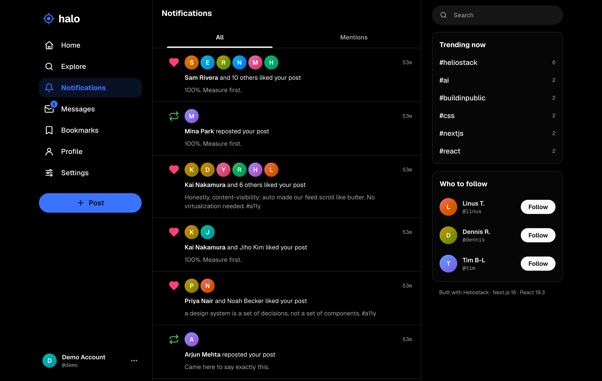
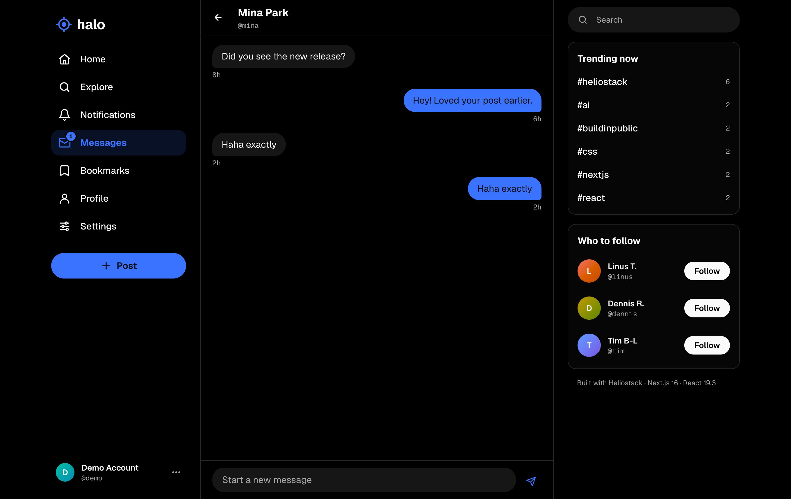
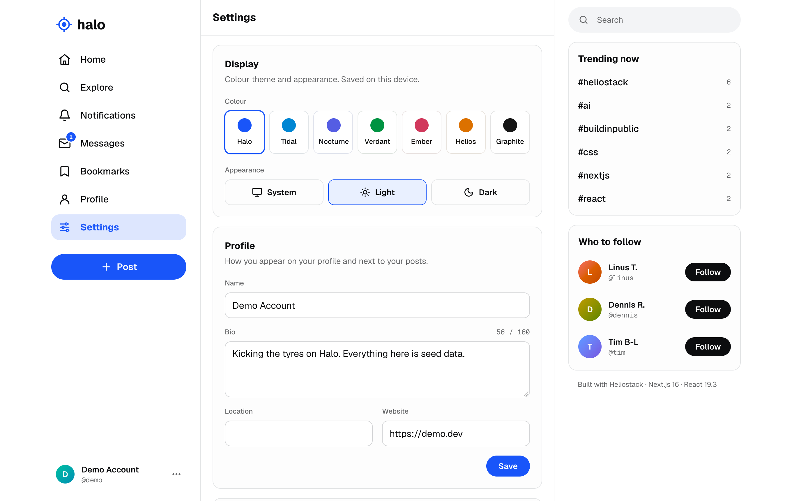
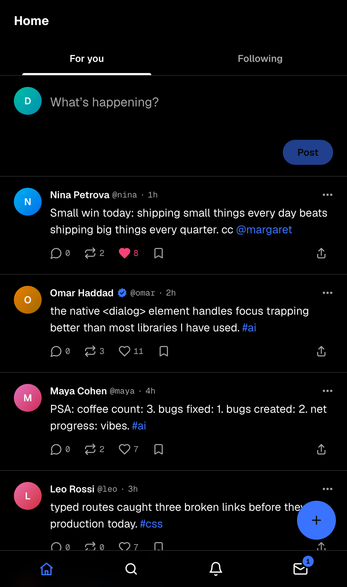
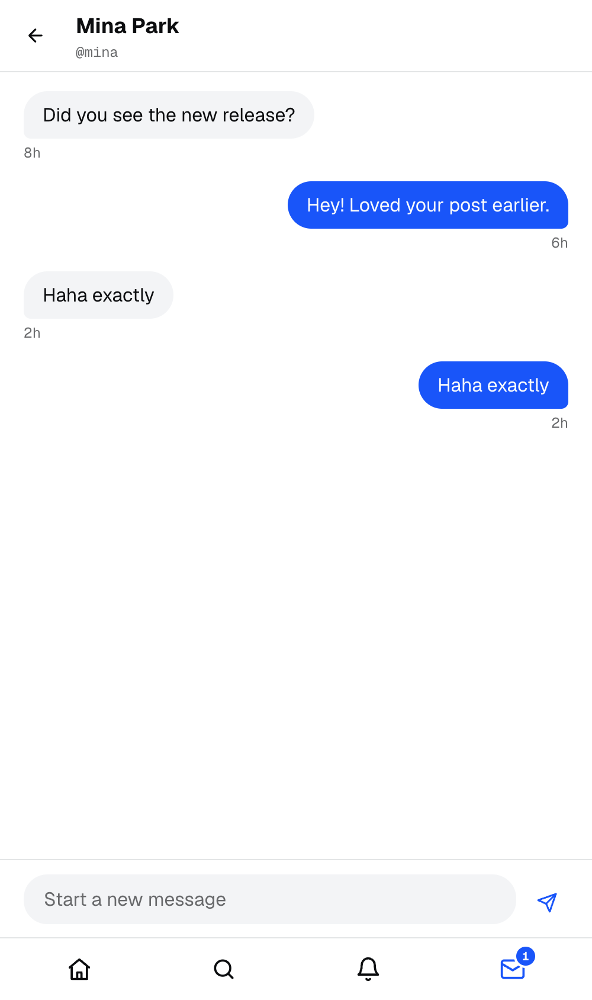
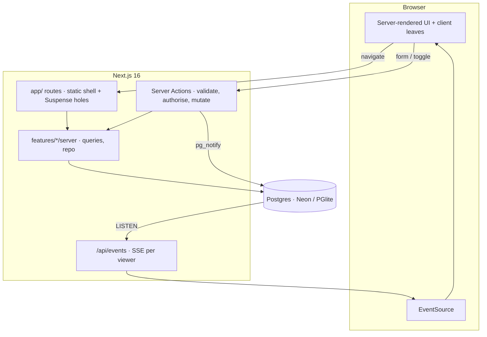

<div align="center">


# Halo

**A realtime social network, built by AI agents with the [Heliostack skills](https://github.com/heliostack/skills).**

[](https://nextjs.org)
[](https://react.dev)
[](https://www.typescriptlang.org)
[](https://neon.tech)
[](#whats-inside)
[](LICENSE)

[Features](#features) · [Quick start](#quick-start) · [What's inside](#whats-inside) · [Architecture](#architecture) · [Deploy](#deploy)

<br />


</div>

<br />

Halo exists to test one claim: **an agent that follows a small set of well-made skills can build a product-grade app of this size on the platform alone.** No ORM, no auth SDK, no UI kit, no state or data-fetching library, no animation library, no websocket service, no test framework.

## Features

<table>
<tr>
<td width="50%" valign="top">

**Timelines** — ranked _For you_ and chronological _Following_, reposts deduplicated, infinite scroll, live "Show N new posts".

**Posts** — threads, reposts, quotes, likes, bookmarks, #hashtags and @mentions. Every toggle is optimistic with rollback.

**Compose as a route** — `/compose/post` opens a dialog over whatever page you're on, and still works on refresh or as a shared link.

**Public by default** — no landing page: visitors land on the real timeline, profiles and posts, with a slim signup bar.

</td>
<td width="50%" valign="top">

**Profiles** — cached headers, posts / replies / likes tabs, followers and following, optimistic follow.

**Notifications** — grouped ("Sam and 10 others liked your post"), unread state synced across tabs in realtime.

**Messages** — 1:1 DMs with optimistic send, live delivery, read receipts and IME-safe Enter-to-send.

**Explore & settings** — full-text search, people search, trends, hashtag pages, 7 themes × light / dark / system.

</td>
</tr>
</table>

<table>
<tr>
<td width="50%"></td>
<td width="50%"></td>
</tr>
<tr>
<td width="50%"></td>
<td width="50%"></td>
</tr>
</table>

<p align="center">
  
  &nbsp;&nbsp;
  
</p>

## Quick start

Requires **Node 24+** and **pnpm**. No Docker — local Postgres runs as WASM.

```bash
pnpm install
cp .env.example .env.local        # then set SESSION_SECRET (the command is in the file)

pnpm dev:db                       # Postgres (PGlite) on :5432 — leave it running
pnpm db:migrate && pnpm db:seed   # 40 users, ~660 posts, likes, follows, DMs
pnpm dev                          # http://localhost:3000
```

Sign in as **`demo` / `halo-demo`** — or just browse signed-out.

```bash
pnpm verify    # typecheck (typed routes) → ds:check (contrast + token lint) → test → build
```

## What's inside

```
runtime dependencies  →  next · react · react-dom · postgres · zod
```

| Need | How Halo does it |
|---|---|
| Rendering | Cache Components + Partial Prerendering — every page ships a static shell from the CDN; per-user parts stream in behind `<Suspense>` |
| Data | Raw tagged SQL with postgres.js, one hydration query per list, counters kept by triggers, `tsvector` search |
| Mutations | Server Actions: validate (zod) → authorise in SQL → mutate → `updateTag` / `refresh` → publish |
| Optimistic UI | `useOptimistic` over locally confirmed state — instant, with automatic rollback |
| Auth | `node:crypto` scrypt, 256-bit session tokens stored as HMAC hashes, `proxy.ts` for optimistic redirects |
| Realtime | Server-Sent Events fed by Postgres `LISTEN/NOTIFY` (in-memory bus locally), ids-only events routed per viewer |
| Modals & menus | Native `<dialog>`, the Popover API and CSS anchor positioning; `@starting-style` animations |
| Long lists | `content-visibility: auto` instead of a virtualization library |
| Theming | `light-dark()` OKLCH tokens generated from `design-system.json`, switched pre-paint by an inline script |
| Tests | `node:test` running TypeScript directly, a fresh real Postgres (PGlite) per test file |

## Architecture



| Path | What |
|---|---|
| `src/app` | Routes only — `(auth)`, the `(app)` shell with an `@modal` slot, `api/events` |
| `src/features/*` | Vertical slices: `types.ts`, `server/repo.ts` (pure SQL, tested), `server/queries.ts`, `actions.ts`, `components/` |
| `src/server` | env, database, auth, realtime bus, cache tags, test DB helper |
| `src/ui` | Native design system — start with [`src/ui/CATALOG.md`](src/ui/CATALOG.md) |
| `db/migrations` | Schema, counter triggers, full-text search |
| `scripts` | `dev-db`, `migrate`, `seed` — plain TypeScript run by Node |
| `design` | Theme engine and token linter vendored from the `ds-init` skill |

Working on Halo with an agent? [`AGENTS.md`](AGENTS.md) has the house rules.

## Deploy

Vercel + Neon Postgres (Vercel Marketplace). Set:

| Variable | Purpose |
|---|---|
| `DATABASE_URL` | Pooled connection for queries |
| `DATABASE_URL_UNPOOLED` | Direct connection — enables cross-instance realtime (`LISTEN`) and migrations |
| `SESSION_SECRET` | 32+ random bytes; rotating it signs everyone out |

Step-by-step in the [`deploy-vercel`](https://github.com/heliostack/skills/blob/main/skills/deploy-vercel/SKILL.md) skill.

## License

[MIT](LICENSE)
