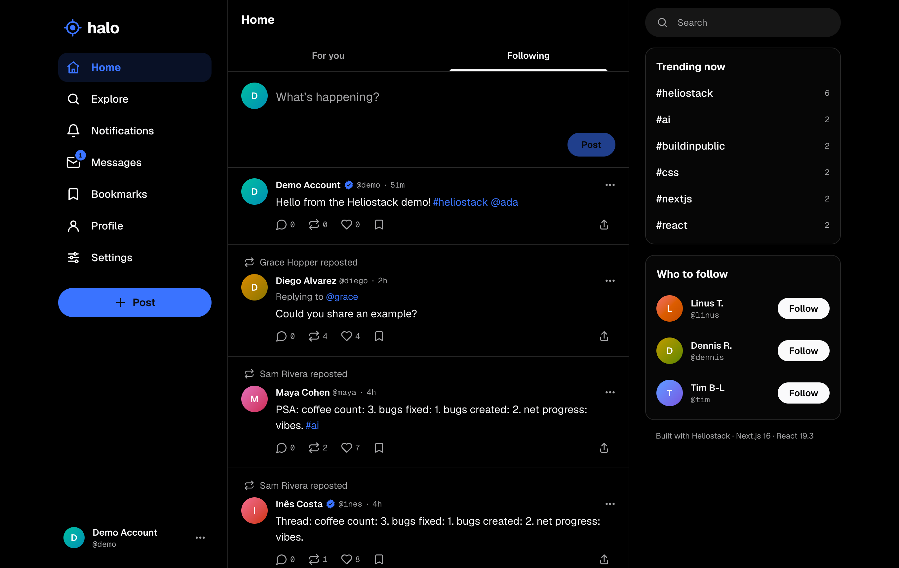
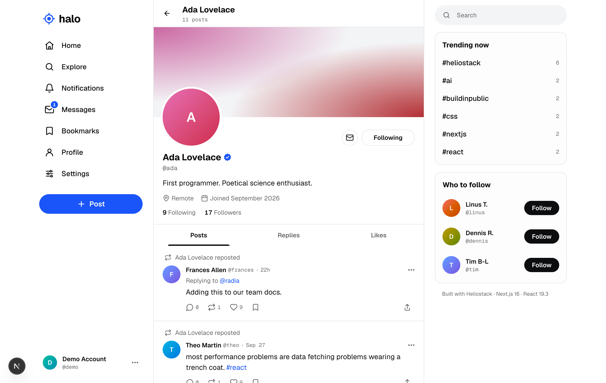

# Halo

A realtime social network — timelines, threads, reposts and quotes, follows, notifications, direct messages, search and trends — built by AI agents with the [**Heliostack skills**](https://github.com/heliostack/skills).




## The point

Halo exists to prove a claim: an agent following a small set of well-made skills can build a product-grade app of this size on the platform alone.

```
runtime dependencies:  next 16.3 · react 19.3 · react-dom · postgres · zod
```

No ORM, no auth SDK, no UI kit, no state library, no data-fetching library, no animation library, no websocket service, no test framework. Instead: Server Components and Actions, Cache Components with Partial Prerendering, `useOptimistic`, `<dialog>`, the Popover API, CSS anchor positioning, `light-dark()` OKLCH tokens, Server-Sent Events over Postgres `LISTEN/NOTIFY`, `node:test` against real Postgres in WASM.

## Features

- **Timelines**: ranked "For you" and chronological "Following" (reposts deduped), infinite scroll, "Show N new posts" over realtime
- **Posts**: replies with threads, reposts, quotes, likes, bookmarks, hashtags, mentions, delete; optimistic toggles with rollback
- **Compose** as a route: `/compose/post` opens a dialog over the current page (intercepted route), works on refresh too
- **Profiles**: cached headers (`use cache` + tags), posts/replies/likes tabs, followers/following, follow with optimistic UI
- **Notifications**: grouped ("Ada and 4 others liked your post"), unread tracking synced across tabs
- **Messages**: 1:1 DMs, optimistic send, live updates, read receipts, IME-safe Enter to send
- **Explore**: full-text post search, people search, trends, hashtag pages
- **Settings**: 7 themes × light/dark/system, profile editing
- **Public by default**: `/` goes straight to the timeline; profiles, posts, search and hashtags are readable signed-out, with a slim signup bar instead of a landing page
- Every page is partially prerendered: the static shell comes from the CDN, per-user parts stream in

## Run it

```bash
pnpm install
cp .env.example .env.local           # then set SESSION_SECRET (command in the file)
pnpm dev:db                          # Postgres via PGlite on :5432 — no Docker
pnpm db:migrate && pnpm db:seed      # 40 users, ~660 posts, likes, follows, DMs
pnpm dev                             # http://localhost:3000 — sign in as @demo / halo-demo
```

```bash
pnpm verify        # typecheck (typed routes) → ds:check (contrast + token lint) → test → build
```

## Map

| Path | What |
|---|---|
| `src/app` | Routes only: `(auth)`, `(app)` shell with `@modal` slot, `api/events` (SSE) |
| `src/features/*` | Vertical slices: `types.ts`, `server/repo.ts` (pure SQL, tested), `server/queries.ts`, `actions.ts`, `components/` |
| `src/server` | env, database, auth (scrypt + HMAC sessions), realtime bus, cache tags, test DB helper |
| `src/ui` | Native design system — see `src/ui/CATALOG.md`; tokens generated from `design-system.json` |
| `db/migrations` | Schema, triggers for counters, full-text search |
| `scripts` | `dev-db`, `migrate`, `seed` — plain TypeScript run by Node |
| `design` | Vendored theme engine and token linter from the `ds-init` skill |

## Deploy

Vercel + Neon Postgres — see the `deploy-vercel` skill. Needs `DATABASE_URL`, `DATABASE_URL_UNPOOLED` (enables cross-instance realtime) and `SESSION_SECRET`.

## License

MIT
