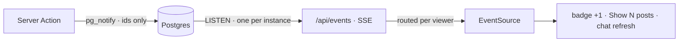

<div align="center">


# Halo

**A realtime social network, built by AI agents with the [Heliostack skills](https://github.com/heliostack-dev/skills).**

**[Live demo → heliostack-halo.vercel.app](https://heliostack-halo.vercel.app)** &nbsp;·&nbsp; browse signed-out, or sign in as `demo` / `halo-demo`

[](https://nextjs.org)
[](https://react.dev)
[](https://www.typescriptlang.org)
[](https://neon.tech)
[](#dependencies)

<br />

<a href="https://heliostack-halo.vercel.app"></a>

</div>

<br />

Halo tests one claim: **an agent that follows a small set of well-made skills can build a product-grade app on the platform alone.** Timelines, threads, reposts and quotes, follows, grouped notifications, direct messages, search, trends and seven themes — in ~5,400 lines of TypeScript with five runtime dependencies.

## Contents

- [How it's built](#how-its-built) — rendering · data · mutations · realtime · auth · UI · tests
- [Feature notes](#feature-notes) — what each feature does and where the interesting code is
- [Run it locally](#run-it-locally)
- [Deploy](#deploy)

## How it's built

### Rendering: static shells + streamed holes

`cacheComponents: true` + `partialPrefetching: true`. Every page is **partially prerendered** (`◐` in the build output): the shell — sidebar, header, tabs, trends — is static HTML from the CDN, and per-user parts stream in behind `<Suspense>`.

| Data | Treatment | Example |
|---|---|---|
| Same for everyone, minutes-stale OK | `'use cache'` + `cacheLife('minutes')` + `cacheTag(...)` | trends, profile headers, hashtag counts |
| Personalised or must be fresh | uncached, `<Suspense>` as deep as possible | feeds (viewer's liked state), unread badges, composer |
| URL-dependent | `params` / `searchParams` promises passed down, awaited inside a boundary | `/login?next=`, `/explore?q=` |

Layouts never await request data, so navigating between pages is instant. Cache tags are built in one place ([`src/server/cache-tags.ts`](src/server/cache-tags.ts)) so writers and readers can't drift.

### Data: raw SQL, pure repositories, one query per list

- **postgres.js** tagged templates — no ORM. Repositories ([`src/features/*/server/repo.ts`](src/features/posts/server/repo.ts)) are pure `(db, …args)` functions with no Next.js imports, which is what makes them testable against a real database.
- **Lists fetch ids, then hydrate once.** A feed query returns post ids (an index scan); [`hydrate()`](src/features/posts/server/repo.ts) turns them into full cards — author, counts, the viewer's like/repost/bookmark state, reply target, reposter — in a single statement ordered by `unnest(...) with ordinality`, plus one batched query for quoted posts. No N+1.
- **A repost is a post row** (`repost_of_id`), so the home timeline is one id-cursor query. A post reposted by several people you follow appears once (`distinct on (coalesce(repost_of_id, id))`).
- **"For you"** ranks the last 14 days by `(1 + likes + 2·reposts + replies + 2·quotes) / (hours + 2)^1.4` with an offset cursor; the client dedupes across pages.
- **Counters live in triggers** ([`db/migrations/0001_init.sql`](db/migrations/0001_init.sql)) — likes, reposts, replies and followers can never drift from the rows.
- **Search** is Postgres full-text (`tsvector` with the `simple` config, so Korean and code work) plus prefix search on handles and names.

### Mutations: one pipeline, optimistic UI

Every Server Action follows the same steps — [`createPostAction`](src/features/posts/actions.ts) is the reference:

```
requireViewer() → zod parse → repo (authorisation inside the SQL) → updateTag / refresh() → publish realtime event → ActionState
```

Likes, reposts, bookmarks and follows are **optimistic**: `useOptimistic` layered over locally confirmed state, so the UI flips instantly and rolls back on failure ([`post-actions.tsx`](src/features/posts/components/post-actions.tsx)). Every mutation is idempotent (`on conflict do nothing`), so double clicks are harmless.

### Realtime: SSE over Postgres NOTIFY



- Events carry **ids, never content**; the browser refetches through the normal authorised paths ([`src/server/realtime`](src/server/realtime)).
- [`/api/events`](src/app/api/events/route.ts) filters per viewer (posts from people you follow, your notifications, your conversations), sends a heartbeat every 20 s and closes itself before the serverless time limit; `EventSource` reconnects. Signed-out visitors get **204**, which tells `EventSource` to stop.
- Locally the bus is in-memory, because PGlite is single-session and cross-connection `NOTIFY` can't fire.

### Auth: ~150 lines, no SDK

scrypt from `node:crypto` for passwords; 256-bit random session tokens in an httpOnly cookie, stored in the database only as `HMAC(SESSION_SECRET, token)`; sliding 30-day expiry ([`src/server/auth`](src/server/auth)). [`proxy.ts`](src/proxy.ts) does optimistic redirects from cookie presence only — real checks happen next to the data. The timeline, profiles, posts and search are **public**; there's no landing page.

### UI: a native design system

- Tokens generated from [`design-system.json`](design-system.json) by the `ds-init` theme engine: OKLCH colours with `light-dark()`, 7 WCAG-checked themes, a 12/14/16 px type scale.
- 17 components in [`src/ui`](src/ui/CATALOG.md) built on the platform: `<dialog>` modals, Popover API menus positioned with **CSS anchor positioning**, `@starting-style` animations, and `content-visibility: auto` instead of a virtualization library.
- **Compose is a route.** `/compose/post` is intercepted by `@modal/(.)compose/post` and opens as a dialog over the current page; a direct visit still works.
- A token linter ([`design/check-tokens.mjs`](design/check-tokens.mjs)) fails any raw colour or spacing value, and any CSS file that doesn't declare the cascade-layer order on line 1.

### Tests: real Postgres, no framework

`node:test` runs the TypeScript sources directly. [`useTestDb()`](src/server/testing.ts) boots a fresh in-memory Postgres (PGlite, WASM) per test file behind the wire protocol, so tests use the same driver and migrations as production — no mocks, no Docker. 26 tests cover threads, idempotent toggles, pagination edges, repost dedupe, authorisation, notification grouping and text parsing.

## Feature notes

| Feature | Notes | Code |
|---|---|---|
| Timelines | ranked *For you*, chronological *Following*, infinite scroll via a Server Function, live "Show N new posts" | [`posts/`](src/features/posts) |
| Threads | ancestors via a recursive CTE, focused post, replies ranked by likes | [`status/[postId]`](src/app/(app)/[handle]/status/[postId]/page.tsx) |
| Profiles | cached header per handle, relationship streamed separately, posts / replies / likes tabs | [`profiles/`](src/features/profiles) |
| Notifications | likes, reposts and follows grouped per post ("Sam and 10 others…"), read state synced across tabs | [`notifications/group.ts`](src/features/notifications/group.ts) |
| Messages | 1:1 DMs, membership checked in SQL, optimistic send, IME-safe Enter to send | [`messages/`](src/features/messages) |
| Explore | full-text posts, people search, trends, hashtag pages | [`explore/`](src/features/explore) |
| Settings | theme + light / dark / system switcher (applied pre-paint, no flash), profile editing | [`settings/`](src/features/settings) |

## Run it locally

Requires Node 24+ and pnpm. No Docker — local Postgres runs as WASM.

```bash
pnpm install
cp .env.example .env.local        # set SESSION_SECRET (command in the file)
pnpm dev:db                       # Postgres (PGlite) on :5432 — keep it running
pnpm db:migrate && pnpm db:seed   # 40 users, ~660 posts, likes, follows, DMs
pnpm dev                          # http://localhost:3000
```

```bash
pnpm verify   # typecheck (typed routes) → ds:check → test → build
```

### Dependencies

```
runtime   next · react · react-dom · postgres · zod
dev       typescript · @types/* · @electric-sql/pglite · @electric-sql/pglite-socket
```

## Deploy

Vercel + Neon (Vercel Marketplace). The `vercel-build` script runs migrations over the direct connection before `next build`.

| Variable | Purpose |
|---|---|
| `DATABASE_URL` | pooled connection for queries (set by the Neon integration) |
| `DATABASE_URL_UNPOOLED` | direct connection — migrations and cross-instance realtime (`LISTEN`) |
| `SESSION_SECRET` | 32+ random bytes; rotating it signs everyone out |

Full walkthrough: the [`deploy-vercel`](https://github.com/heliostack-dev/skills/blob/main/skills/deploy-vercel/SKILL.md) skill.

## License

[MIT](LICENSE)
